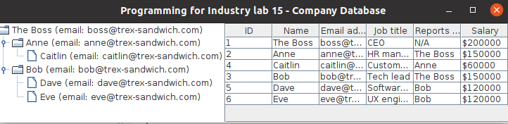

Lab - Design Pattern
==========

Before you start
----------
In today's lab, you'll be working to create the beginnings of an employee database Swing application. The app will be able to display information about employees in a GUI, including who their managers are. Each exercise will involve adding a little more functionality to the app.

Below is the sample UI of complete application.

In addition to the code which you must complete, a set of unit tests has been provided which should help you debug any errors. The unit tests which should pass at the end of each lab exercise are given in the corresponding exercise.

## Exercise One: Employees and Managers
In this exercise, you'll begin by completing the "class" to be used by the app - the `Employee` and `Manager` classes. These classes should be implemented following the *composite* design pattern: each `Manager` is a special kind of `Employee` who can also manage other employees. Each `Employee` also knows who its manager is.

To begin, skeleton code for the two classes is given to you. Complete this code by following these steps:

1. Add necessary fields to the `Employee` and `Manager` classes, and complete the constructors which should populate those fields.

2. Add necessary *getter* methods to `Employee`. `TestEmployeeAndManager.testGetters()` can show you which getters you need.

3. Complete all method skeletons provided in the `Employee` and `Manager` classes. To understand what each method should do, please read the method comments, and look at the unit tests (each method to implement has at least one unit test associated with it).

When complete, all unit tests in the `TestEmployeeAndManager` class should pass. **Note:** Having these tests pass is a good indication that your code is correct, but not a guarantee - you should still have your code checked by a tutor if you're unsure!

**Hint:** Some of the method comments contain hints about how the corresponding methods can be implemented. Make sure to read them if you're stuck! You can also carefully examine the unit tests to see what the results of various methods should be for various inputs.

## Exercise Two: Displaying employees in a JTree
In this exercise, we'll get our employment hierarchy displayed to the user in a `JTree`.

`JTree` pulls the data it displays from an instance of a `TreeModel`. However, we have a `Manager` that we want to display, rather than a `TreeModel` (called `ceo` in `EmployeeApp`'s `initGui()` method). This means we must create an *adapter* to allow an `Employee` to be displayed in a `JTree`.

For this exercise, complete the `EmployeeTreeAdapter`, a skeleton of which has been provided to you. Use the unit tests in `TestEmployeeTreeModel`, plus the [TreeModel documentation](https://docs.oracle.com/en/java/javase/11/docs/api/java.desktop/javax/swing/tree/TreeModel.html), to guide you. For this exercise, you may ignore the `valueForPathChanged()`, `addTreeModelListener()`, and `removeTreeModelListener()` methods (i.e. leave them blank).

Once all `TestEmployeeTreeModel` unit tests pass, then appropriately modify `EmployeeApp.initGui()` so that an instance of `EmployeeTreeAdapter` is used to display the provide `ceo` in the `tree`.

## Exercise Three: Displaying employees in a JTable
In this exercise, we'll get our employee details displayed to the user in a `JTable`.

Similarly to Exercise Three above, we want to display information in a `JTable`, but these tables get their information from a `TableModel` whereas we have an `Employee` instead. We must again create an adapter.

For this exercise, complete the `EmployeeTableAdapter`, a skeleton of which has been provided to you. Use the unit tests in `TestEmployeeTableModel`, plus the [TableModel documentation](https://docs.oracle.com/en/java/javase/11/docs/api/java.desktop/javax/swing/table/TableModel.html), to guide you.

Once all `TestEmployeeTableModel` unit tests pass, then appropriately modify `EmployeeApp.initGui()` so that an instance of `EmployeeTableAdapter` is used to display the provide `ceo` in the `table`.

**Hint:** What `Manager` method, which you implemented in Exercise One, could be used to get a list of *all* employees?

Submit this lab
------------------
You can submit this lab by simply pushing the code to the Github. 
